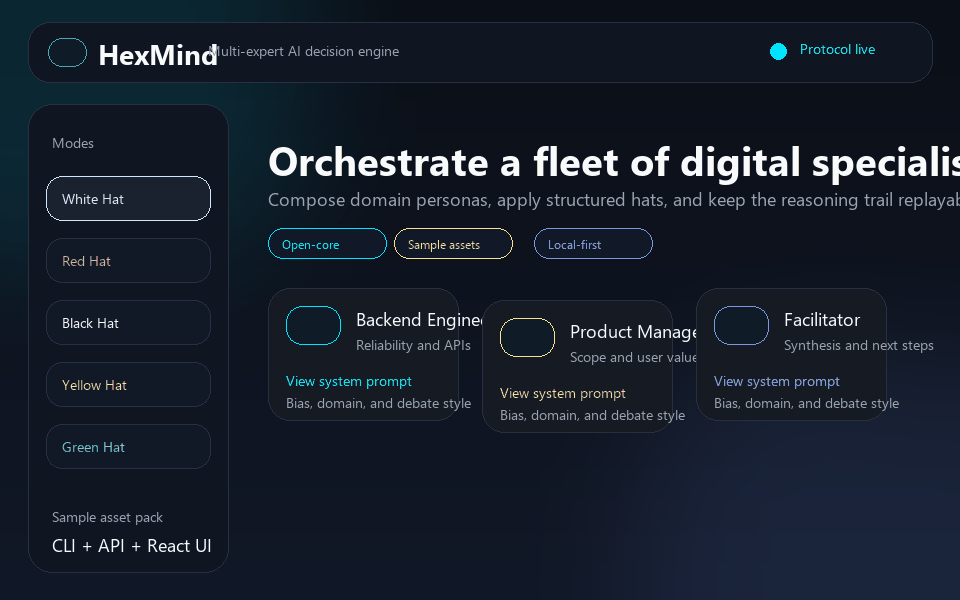
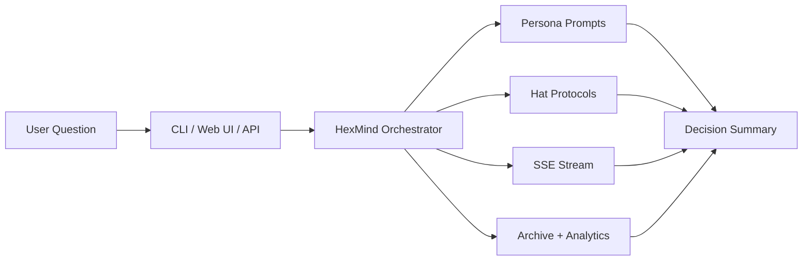

# HexMind

<div align="center">
  <p>
    <a href="https://github.com/xuxiaodizzz-blip/hexmind/actions/workflows/ci.yml"></a>
    <a href="https://github.com/xuxiaodizzz-blip/hexmind/releases/latest"></a>
    <a href="https://github.com/xuxiaodizzz-blip/hexmind/blob/main/LICENSE"></a>
    <a href="https://github.com/xuxiaodizzz-blip/hexmind/stargazers"></a>
  </p>
  
  <p><strong>Multi-expert debate, live streaming, and inspectable decision trails.</strong></p>
  <p>
    <a href="https://github.com/xuxiaodizzz-blip/hexmind/releases/latest">Latest Release</a>
    ·
    <a href="#quick-start">Quick Start</a>
    ·
    <a href="#core-capabilities">Core Capabilities</a>
  </p>
  <p><sub>Open-core edition · Sample asset pack · MIT licensed</sub></p>
</div>

HexMind is a multi-expert AI decision engine that combines persona-based analysis, the Six Thinking Hats protocol, real-time streaming, and a local-first workflow.

This public repository is the open-core edition of HexMind:

- It includes the orchestration engine, API, React web app, tests, and a small sample asset library.
- It excludes the full commercial prompt library, raw prompt source material, and SaaS-only operating assets.

## Why HexMind

Most AI workflows stop at a single prompt and a single answer.

HexMind is built for decisions that benefit from structured disagreement:

- Multiple expert personas can analyze the same question from different domains.
- Six Thinking Hats keep reasoning modes explicit instead of blending facts, risks, ideas, and emotion together.
- Server-Sent Events stream the discussion live as it unfolds.
- Archive and analytics layers make the decision trail inspectable after the run.

## What Makes It Different

- It treats role prompts and hat protocols as separate building blocks instead of baking every bias into one monolithic system prompt.
- It is local-first, so you can explore the decision engine without depending on a hosted SaaS control plane.
- It keeps a visible reasoning trail, which makes it easier to audit, replay, and debug how a conclusion was formed.

## What This Public Repo Includes

- `src/hexmind/`: core engine, auth, archive, API, knowledge, and CLI code
- `web/`: React frontend source and build tooling
- `tests/`: regression coverage for the engine and API
- `personas/` and `prompts/library/`: intentionally small sample assets for demos and local development

## What Stays Private In The Hosted Product

- Expanded curated prompt packs and role libraries
- Raw prompt collection and import pipelines
- SaaS operations, deployment workflows, billing, analytics, and growth assets

## Core Capabilities

- Persona orchestration for domain-specific analysis
- Six Thinking Hats style structured debate
- Convergence tracking and decision-tree style reasoning flow
- CLI for local-first workflows
- FastAPI backend with streaming discussion endpoints
- React frontend for history, analytics, teams, and discussion views
- Archive and export paths for replayable decisions

## Try In 60 Seconds

```bash
pip install -e ".[dev]"
hexmind personas
hexmind prompts
hexmind ask "Should we use Kubernetes for a small product team?" --model gpt-4o-mini
```

If the repository looks useful for your own agent workflows, architecture reviews, or product debates, give it a star so you can find it again.

## Quick Start

### 1. Install

```bash
pip install -e ".[dev]"
```

### 2. Explore Sample Assets

```bash
hexmind personas
hexmind prompts
```

### 3. Run A Discussion From The CLI

```bash
hexmind ask "Should we launch an AI copiloted onboarding flow?" --model gpt-4o-mini
```

### 4. Run The API

```bash
uvicorn hexmind.api.app:app --reload
```

### 5. Run The Web App

```bash
cd web
npm install
npm run dev
```

## Asset Boundaries

HexMind can switch persona and prompt roots through environment variables:

```bash
HEXMIND_PERSONAS_DIR=personas
HEXMIND_PROMPTS_DIR=prompts/library
```

That makes it easy to run the same codebase against:

- the public sample asset bundle in this repository
- a fuller private asset bundle in the hosted product

## Example Use Cases

- Product strategy: should we launch a new feature now or validate demand first?
- Technical architecture: should a small team introduce Kubernetes, queues, or event sourcing?
- Team alignment: how do product, engineering, and facilitator roles surface different risks before a commit is made?

## Open-Source Dependencies

This release uses capabilities from several GitHub-hosted open-source projects, including FastAPI, SQLAlchemy, LiteLLM, Instructor, React, Vite, Tailwind CSS, Recharts, Lucide React, Click, and Rich.

See `ATTRIBUTIONS.md` for a concise breakdown of how those projects are used in this codebase.

## Demo Asset

The animated preview at the top of this README is generated from `docs/public/assets/hexmind-demo.gif`.

For social sharing, a static preview image is also generated at `docs/public/assets/hexmind-social-preview.png`.

## Architecture At A Glance



## Repository Layout

```text
src/hexmind/          core engine, API, auth, archive, models, CLI
web/                  React frontend
tests/                automated tests
personas/             public sample personas
prompts/library/      public sample prompt assets
docs/public/          open-source boundary notes
scripts/              export and asset tooling
```

## Export A Public Repo From A Private Workspace

From the full private workspace, generate a clean GitHub-ready copy with:

```bash
python -X utf8 scripts/prepare_public_repo.py --overwrite
```

The script writes an export to `exports/github-public/`.

## Community

- Read contribution guidance in [CONTRIBUTING.md](CONTRIBUTING.md)
- Report sensitive issues through the process described in [SECURITY.md](SECURITY.md)
- Use [Issues](https://github.com/xuxiaodizzz-blip/hexmind/issues) for bugs and feature requests
- Use [Discussions](https://github.com/xuxiaodizzz-blip/hexmind/discussions) for roadmap questions and open-ended ideas when enabled

## Status

Current package version: `0.1.1`

This repository is already covered by the automated test suite included in `tests/`, and the public release intentionally ships with sample assets instead of the full hosted library.

## License

MIT
